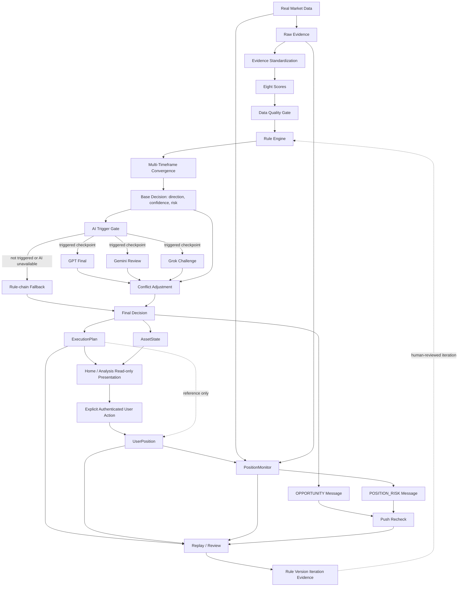
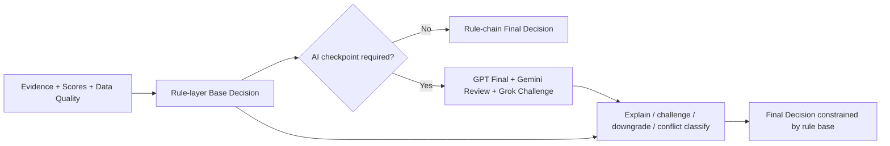
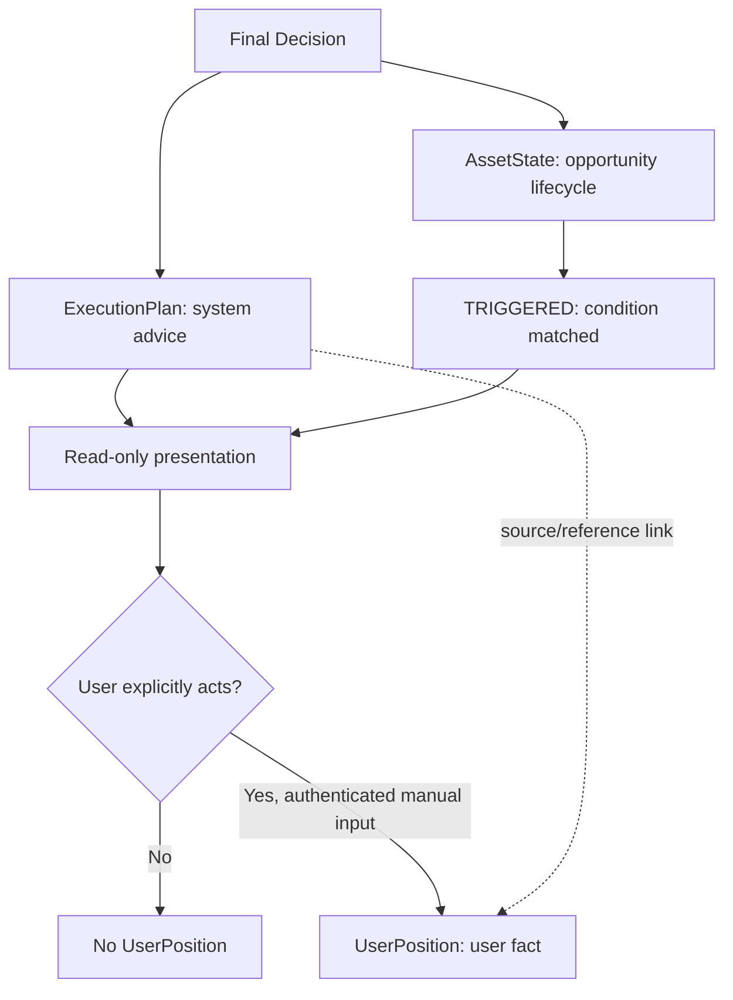
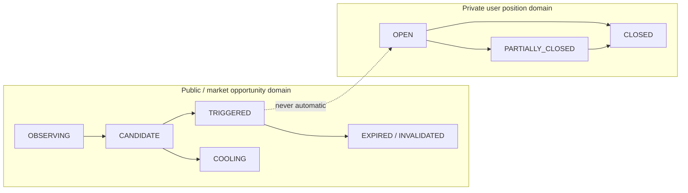
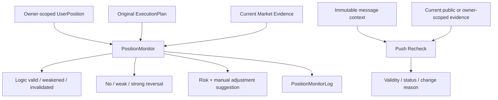
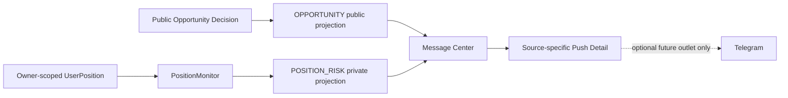
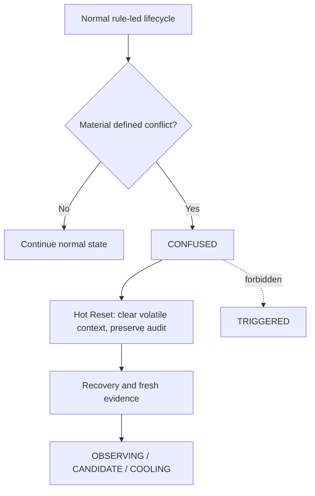

# Trade Model V1 Product Relation Graph

Status: `P0_PRODUCT_BASELINE_FREEZE_CANDIDATE`

This document freezes business relationships. It is not a UI diagram, code architecture, execution engine, or completion claim. Authority: `docs/PRODUCT_SOURCE_OF_TRUTH.md`.

## 1. End-to-End Product Chain

The chain stops at advice and state. No node in this graph automatically opens, closes, reduces, adds, reverses, or executes a trade.

## 2. Rule Layer and AI Authority

- The rule layer owns the base direction and state-machine boundary.
- GPT synthesizes the rule-led result; Gemini reviews conflicts and downgrade needs; Grok supplies counter-evidence and event or microstructure challenge.
- The roles are not three equal voters. No majority vote replaces the rule base.
- AI may reduce confidence, explain conflict, or enter the defined conflict path. It cannot create a direction forbidden by the rule/state contract.
- AI failure uses the documented fallback. It cannot fabricate a result or stop price-safety monitoring of a real manual position.

## 3. Plan, Opportunity, and Real Position Separation

Frozen separation:

- `triggered` is an opportunity condition, not an order and not an opened position.
- `ExecutionPlan` is advice, not a position record.
- `tm_real_position` or exchange-like data cannot silently substitute for `UserPosition`.
- Only an explicit authenticated user action may create or update a user-held position fact.
- A plan may be linked as historical context, but user-entered price, quantity, leverage, stop, target, and time remain distinct facts.

## 4. Asset State and User Position State

The dotted relationship is a prohibited automatic transition. A real user action is required between the domains. Asset selection on Home cannot rebind, create, or alter a selected UserPosition.

## 5. Position Monitor and Push Recheck Separation

| Boundary | PositionMonitor | Push Recheck |
|---|---|---|
| Primary identity | exact `positionId` | exact public message identity or authorized private message identity |
| Purpose | continuously validate a real user's original position logic | re-evaluate the context of a previously surfaced message |
| Private data | owner-scoped position facts and risk | only when source is `POSITION_RISK` and ownership passes |
| Mutation authority | none | none |
| Trading authority | none | none |
| Output | monitor state, reason, risk, suggestion, log | current recheck state, snapshot comparison, change reason |

## 6. Message Domain Separation

- `OPPORTUNITY` is authenticated shared public opportunity data. It contains no UserPosition, account risk, private position risk, private reason, private push identity, or private Recheck reference.
- `POSITION_RISK` is exact owner-scoped private data.
- The two projections must not be carried by one mixed public/private DTO.
- Telegram is an optional future delivery outlet, not a Message Center source, state, or product completion requirement in the current baseline.

## 7. Confused, Hot Reset, and Recovery

Confused is not a synonym for low data quality, empty data, or ordinary observation. Recovery must use fresh evidence and the defined state path; it cannot jump directly to triggered.

## 8. Replay and Rule Iteration

Replay joins the original evidence snapshot, rule version, decision, plan, user action, position facts, monitor history, messages, Recheck results, and actual outcome. It produces review evidence such as executed-valid, executed-invalid, missed-valid, missed-invalid, pushed-not-filled-valid, or blocked-by-risk-valid. Rule changes remain human-reviewed iteration; Replay never mutates live trading state by itself.

## 9. Non-Driving Relationships

The following relationships are explicitly forbidden:

- Tests, Workflow, Governance, or PR metadata driving product semantics.
- AI output bypassing data-quality or rule-layer direction.
- an AssetState transition creating a UserPosition.
- an ExecutionPlan creating or mutating a UserPosition.
- Push Recheck opening, closing, reducing, adding, or reversing a position.
- PositionMonitor automatically closing or reversing a position.
- public OPPORTUNITY identity granting access to private PushRecheck or POSITION_RISK data.
- Home asset selection changing a position identity.
- examples, fallback values, or local fixtures appearing as real production data.
