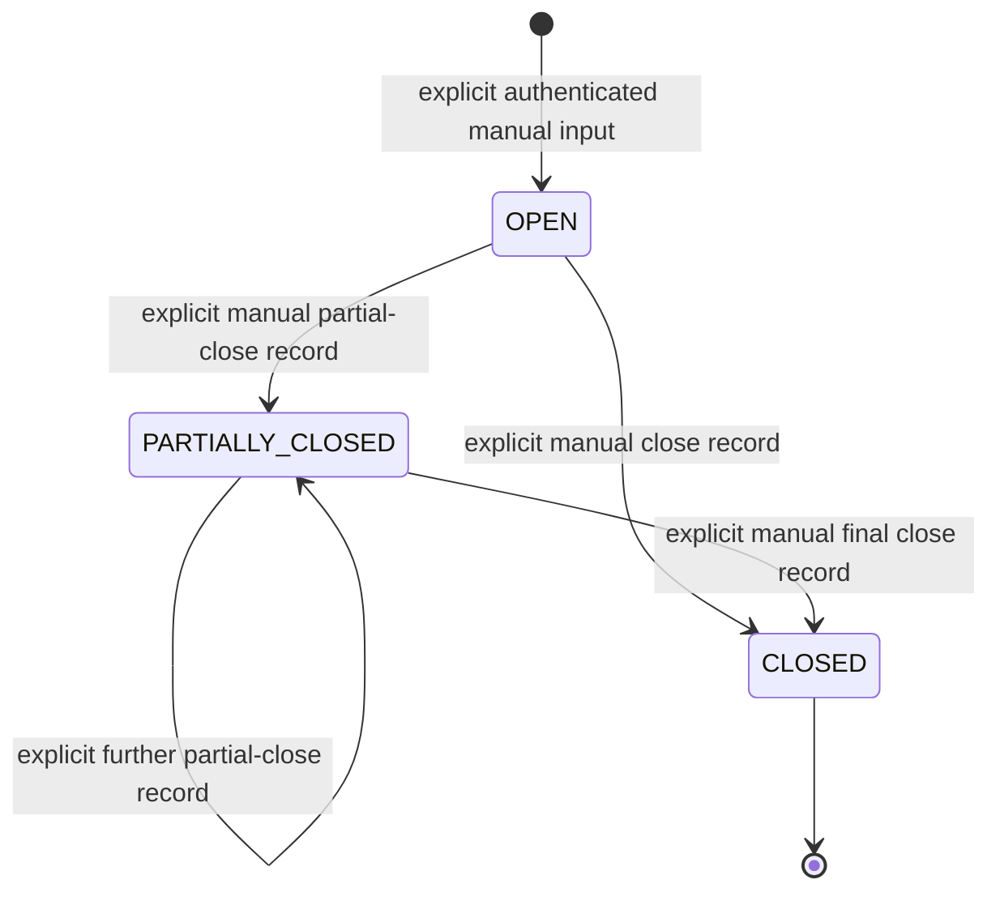

# Trade Model V1 Product State Machines

Status: `P0_PRODUCT_BASELINE_FREEZE_CANDIDATE`

This document freezes separate business state domains and their relationships. It does not authorize automatic trading or invent a new runtime enum. Exact runtime enum names must map to these product meanings without collapsing domains. Authority: `docs/PRODUCT_SOURCE_OF_TRUTH.md`.

## 1. Cross-Domain Rules

1. Each state belongs to one domain and keeps its own authoritative identity.
2. A state transition is driven only by the domain owner named below.
3. Derived presentation may summarize a state but cannot create or mutate it.
4. `triggered` never creates `UserPosition`.
5. `ExecutionPlan` never becomes `UserPosition`.
6. `UserPosition` is created only by an authenticated explicit manual user action.
7. `CLOSED` positions are excluded from open-position monitoring.
8. Confused recovery cannot transition directly to triggered.
9. Push Recheck cannot mutate a position or authorize a trade.
10. PositionMonitor cannot automatically close, reduce, add, or reverse a position.
11. Missing, partial, malformed, stale, and unavailable data fail closed and remain distinguishable.

## 2. Asset State

**Business meaning:** lifecycle of a market opportunity, independent of any user's position.

| Product state | Meaning | Driven by | Allowed next state | Forbidden interpretation | User presentation |
|---|---|---|---|---|---|
| `OBSERVING` | Evidence is monitored; no actionable candidate is established | rule engine with valid data gate | `CANDIDATE`, `COOLING`, remain observing | user owns a position | Home asset status; detail evidence |
| `CANDIDATE` | Conditions are forming but not fully triggered | rule engine and multi-timeframe convergence | `TRIGGERED`, `OBSERVING`, `COOLING`, invalid/expired equivalent | order placed | Home opportunity label and plan readiness |
| `TRIGGERED` | Defined opportunity conditions matched | rule/state machine only | expired, invalidated, cooling, review classification | opened or filled | Opportunity message and plan; never position badge |
| `COOLING` | Re-entry or repeated signal is temporarily suppressed | rule/state timing | `OBSERVING`, `CANDIDATE` after valid reset | Confused or closed position | status label and reason |
| invalid/expired equivalent | Opportunity is no longer valid | rule engine, expiry, revalidation | `OBSERVING` only through fresh evaluation | automatic close | fail-closed status and reason |

AI may explain, challenge, or downgrade within the rule boundary. It cannot independently set an opportunity to triggered.

## 3. Execution Plan State

**Business meaning:** a versioned system recommendation tied to an analysis/evidence snapshot.

| State | Meaning | Driver | Allowed transition | Forbidden transition/use | Presentation |
|---|---|---|---|---|---|
| `DRAFT/INCOMPLETE` | required plan fields or source gate are incomplete | plan generation pipeline | valid, invalid, expired | shown as executable recommendation | Partial or unavailable |
| `VALID` | source, decision, boundaries, and validity are complete | rule-led plan service | revalidated, invalidated, expired | automatic order or position | Home plan summary and detail |
| `REVALIDATION_REQUIRED` | market/evidence drift requires a fresh check | time/evidence gate | valid, invalidated, expired | silently treated as valid | explicit recheck-needed state |
| `INVALIDATED` | invalidation conditions or contradictory evidence hold | rule/revalidation | no direct resurrection; fresh plan required | closed position | invalid reason |
| `EXPIRED` | validity window ended | time gate | fresh plan only | latest-plan fallback without identity | expired label |

Identity is exact `executionPlanId` or the authoritative linked identity. Symbol-only or “latest” inference is not sufficient where an exact plan is required.

## 4. User Position State

**Business meaning:** authenticated user-declared real position facts.

| State | Monitored as open? | Allowed driver | Forbidden driver |
|---|---:|---|---|
| `OPEN` | yes | explicit user record | AssetState, AI, plan, message, monitor |
| `PARTIALLY_CLOSED` | yes, for remaining quantity | explicit user record | automatic suggestion or risk alert |
| `CLOSED` | no | explicit user close record | monitor, Recheck, rule state |

The product preserves user actual entry price/time, size, leverage, stop/target, direction, notes, and linked original plan separately from system-derived values.

## 5. Position Monitor State

**Business meaning:** current validation of the original position thesis, risk, and evidence for an owner-scoped open or partially closed UserPosition.

### Logic state

| State | Meaning | Minimum condition | UI behavior |
|---|---|---|---|
| `LOGIC_VALID` | original entry thesis remains supported | valid current evidence and legal complete monitor result | show current conclusion and reason |
| `LOGIC_WEAKENED` | thesis is still legal but materially weaker | valid current evidence with defined weakening | show warning and manual suggestion |
| `PLAN_INVALIDATED` | original thesis or plan validity no longer holds | complete legal invalidation evidence | show high-priority manual review suggestion |

### Reversal and risk

- Reversal is independently classified as none, weak, or strong.
- A short wick alone is not a strong reversal.
- Account risk and monitor composite risk may differ because they measure different dimensions.
- Unknown enums, identity mismatch, malformed data, or contradictory combinations are `ERROR`, not a guessed monitor state.
- Legal but incomplete processing or missing non-critical result fields is `PARTIAL`, not `READY`.
- List and detail must resolve state from the same authoritative latest monitor and the same resolver.

### Read-state envelope

| State | Meaning |
|---|---|
| `READY` | exact owner identity and authoritative latest monitor are complete, valid, and legal |
| `PARTIAL` | visible legal resource exists but data is incomplete or in a legal intermediate state |
| `ERROR` | malformed, illegal, contradictory, unknown, or mismatched state |
| `MISSING` | exact resource is absent or not visible to the current user |
| `EMPTY` | an authorized collection contains no items |

PositionMonitor can emit logs, alerts, and manual suggestions. It cannot mutate UserPosition.

## 6. Push Recheck State

**Business meaning:** re-evaluation of a prior message snapshot against current authorized evidence.

| State | Meaning | Required completeness | Forbidden effect |
|---|---|---|---|
| `READY` | latest recheck is complete and interpretable | valid recheck status, recheck time, execution status `COMPLETED`, valid source boundary | trade or position mutation |
| `PARTIAL` | legal recheck exists but one or more required fields are incomplete or processing | legal known intermediate data | successful result presentation |
| `ERROR` | illegal/unknown/malformed recheck data | explicit failure reason where safe | pass-through unknown enum |
| `MISSING` | exact authorized message/recheck resource does not exist or is not visible | none | symbol/latest fallback |
| `EMPTY` | authorized logs collection has no entries | valid empty collection | error rendered as empty |

`OPPORTUNITY` public projection carries no private push identity or private Recheck reference. `POSITION_RISK` Recheck access requires exact owner scope. Possession of a raw `pushId` alone is not authorization.

## 7. Confused State

**Business meaning:** defined material conflict that prevents an honest normal conclusion.

| State | Entry | Exit | Cannot mean |
|---|---|---|---|
| `NOT_CONFUSED` | normal rule-led lifecycle | enter only when formal conflict conditions hold | no conflict data |
| `CONFUSED` | material rule/evidence/role conflict at the defined level | Hot Reset and Recovery with fresh evidence | observing, low data quality, empty data, generic AI disagreement |

Allowed recovery target is observing, candidate, or cooling as the formal source specifies. Direct `CONFUSED -> TRIGGERED` is forbidden.

## 8. Hot Reset and Recovery

| Phase | Meaning | Preserved | Cleared/rebuilt | Forbidden behavior |
|---|---|---|---|---|
| `HOT_RESET_REQUESTED` | a defined conflict requires volatile context reset | immutable audit, source identities, timestamps | volatile evaluation context | deleting evidence history |
| `RESETTING` | rebuild is in progress | audit and safety boundaries | current evidence package and derived decision | presenting stale success |
| `RECOVERING` | fresh data and rule evaluation are being validated | provenance | state eligibility | direct triggered transition |
| `RECOVERED` | legal non-confused state is restored | trace to reset/recovery | normal lifecycle context | automatic trade action |
| `RECOVERY_ERROR` | reset/recovery cannot produce a legal result | failure trace | none | fallback as fabricated success |

## 9. Message State

The source domain and the read-state envelope are separate.

| Source | Classification | Identity/access | Allowed content | Forbidden content |
|---|---|---|---|---|
| `OPPORTUNITY` | authenticated shared public projection | public message identity for authenticated readers | opportunity identity, public status, timestamp, public description | UserPosition, account/position risk, private reason, private push/Recheck identity |
| `POSITION_RISK` | owner-scoped private projection | exact current-user ownership | position identity, symbol, monitor risk/status/reason | another user's data or symbol/latest fallback |

Read-state envelope: `READY`, `EMPTY`, `ERROR`, `MISSING`, `PARTIAL`. A network, parsing, or authorization failure cannot be rendered as a valid empty list.

System notifications, AI-generated free-form messages, Telegram, external-send status, auto-notification, and trading notifications are outside the frozen Message Center sources.

## 10. Data Quality State

| State | Meaning | Decision effect | UI behavior |
|---|---|---|---|
| `READY/FRESH` | required sources are sufficiently complete and current | normal rule evaluation | show values with source time |
| `PARTIAL/DEGRADED` | legal data exists but coverage/freshness is reduced | lower confidence, restrict plan as defined | show degraded/partial reason |
| `STALE` | source is outside accepted freshness | block or require revalidation | show stale, never old success as current |
| `MISSING` | required source/identity absent | no fabricated decision | `--`, unavailable, or missing state |
| `ERROR/MALFORMED` | source fetch/parse/enum/combination failed | fail closed | explicit error and retry when supported |

Low data quality is not Confused. Data quality gates rule/plan readiness; it does not become an AI conflict state.

## 11. Driver Matrix

| Domain | Can drive it | Cannot drive it |
|---|---|---|
| Asset State | rule engine, time/evidence gates | user position, UI, tests, AI alone |
| Execution Plan | rule-led decision and plan generator | click, message, Push Recheck |
| User Position | authenticated explicit user action | plan, AssetState, AI, monitor, message |
| Position Monitor | owner-scoped position + current evidence + original plan | public opportunity, UI cache, Push Recheck |
| Push Recheck | authorized message identity + current source evidence | raw pushId alone, UserPosition mutation |
| Confused | formal conflict evaluator | empty/error/low-quality shortcut |
| Hot Reset/Recovery | defined conflict recovery workflow | UI click that bypasses validation |
| Message | public opportunity or owner-scoped monitor event | arbitrary system/AI free text |
| Data Quality | provider freshness/completeness/validation | AI opinion, workflow status |

## 12. Presentation Rules

- Home shows concise state, source time, and fail-closed status; it does not collapse all failures into missing identity.
- Detail pages expose deeper reasons and trace only for the exact authorized identity.
- Loading, Empty, Error, Partial, and Missing are visually and semantically distinct.
- Cached success cannot overwrite a current refresh error.
- Unknown enum values are never displayed as valid product states.
- Any automatic trading interpretation is a hard stop.
